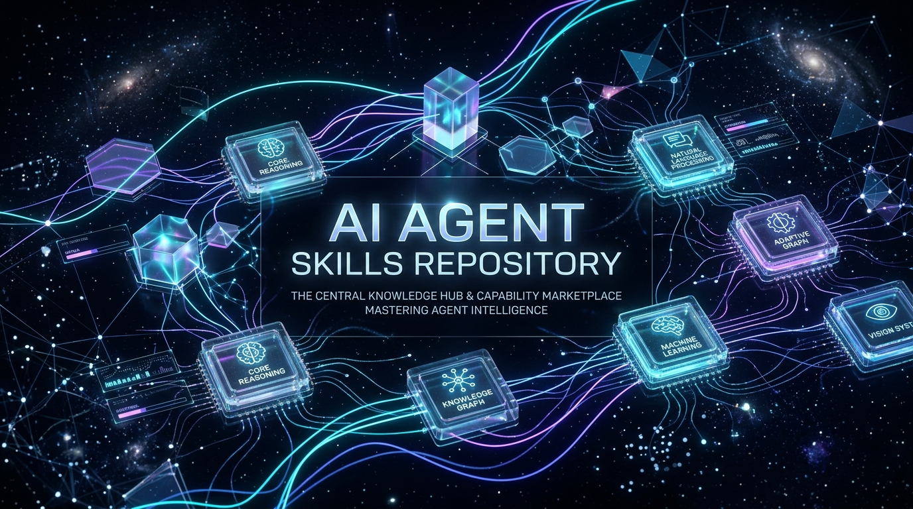

  

# ⚡ Awesome Agent Skills

  <b>🛠️ 个人专属智能体技能库 · 模块化沉淀高频实战技能</b>

  
  
  

---

## 📖 简介

本项目用于整理和沉淀个人日常高频使用的 **AI Agent Skills（智能体技能）**。  
每个技能均经过真实场景调优与效果验证，即插即用。具体的使用方式、触发提示词、输入输出对比及效果解析均统一收录在 [`docs/`](./docs/) 目录中，便于快速查阅和复用。

---

## 🗂️ 技能分类索引

### 🎨 视觉创意 (Creative)

| 技能名称 | 核心作用说明 | 详细效果与用法 | 来源出处 |
| :--- | :--- | :---: | :---: |
| **`art-split-poster`** | 📸 照片转 3:4 竖版五五分艺术海报（上方摄影写实、下方宣纸肌理微插画与留白排版） | [🖼️ 查看详情与效果 ➔](./docs/art-split-poster.md) | [@king1818888](https://x.com/king1818888) |
| **`art-mono-color`** | 🖨️ 单色/双色孔版印刷与网点编辑海报（Risograph、大留白、当代排版） | [🖼️ 查看详情与效果 ➔](./docs/art-mono-color.md) | [@yanliudesign](https://github.com/yanliudesign/mono-color-skill) |

---

### 💻 代码工程 (Coding)

| 技能名称 | 核心作用说明 | 详细效果与用法 | 来源出处 |
| :--- | :--- | :---: | :---: |
| **`dev-architecture-first`** | 🧱 改代码前确认真实目标、责任层、唯一事实源与根因，杜绝盲目打补丁 | [📖 查看详情与用法 ➔](./docs/dev-architecture-first.md) | [@doublesq97-ui](https://github.com/doublesq97-ui/su-architecture-first) |

---

### ⚡ 办公提效 (Productivity)

| 技能名称 | 核心作用说明 | 详细效果与用法 | 来源出处 |
| :--- | :--- | :---: | :---: |
| *(待补充)* | 📋 会议纪要提炼、工作周报结构化与任务拆解 | ⏳ 整理中 | - |

---

### 🔍 调研分析 (Research)

| 技能名称 | 核心作用说明 | 详细效果与用法 | 来源出处 |
| :--- | :--- | :---: | :---: |
| *(待补充)* | 📊 竞品深度分析、前沿论文精读与学术交叉比对 | ⏳ 整理中 | - |

---

## 🚀 快速使用

在支持对应技能的 Agent 环境下，直接用自然语言提示触发即可，例如：
- 💬 *“使用 `art-split-poster` 为这张照片生成一张中国风双拼海报，加一枚红色印章”*
- 💬 *“使用 `art-mono-color` 做一张关于城市夏夜骑行的双色孔版海报，蓝橙叠印”*
- 💬 *“以**架构优先**的方式重构认证模块，分析为什么 token 刷新偶发失败”*

---

## 📄 开源协议 (License)

本项目遵循 [MIT License](LICENSE) 协议开源。
