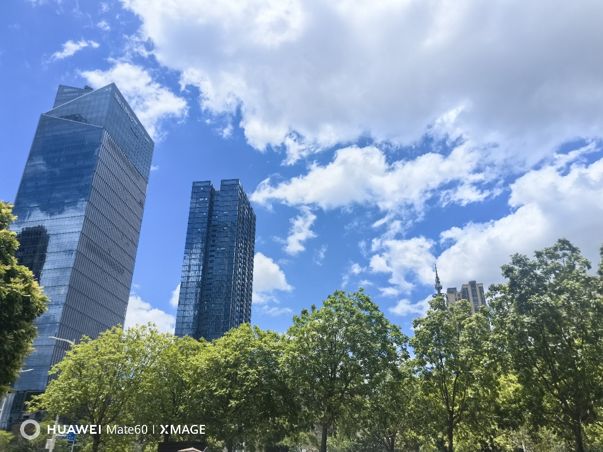
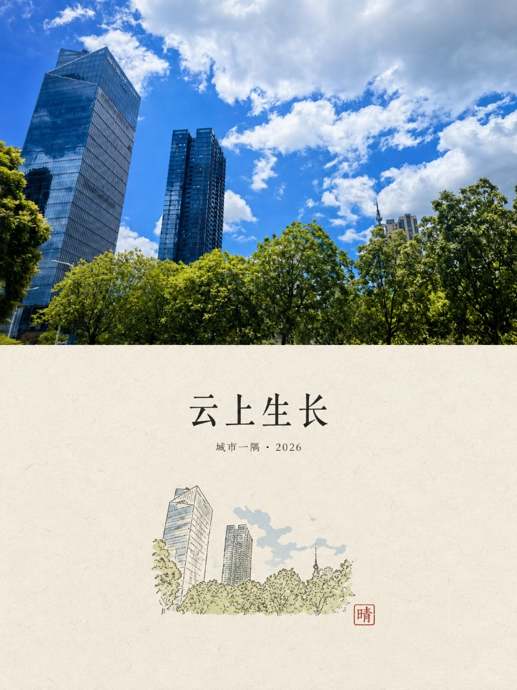

# ⚡ Awesome Agent Skills

<p align="center">
  <b>个人专属智能体技能库 · AI Agent 模块化工程技能整合</b>
</p>

<p align="center">
  
  
  
  
</p>

---

## 📖 目录索引 (Table of Contents)

- [⚡ Awesome Agent Skills](#-awesome-agent-skills)
  - [📖 目录索引 (Table of Contents)](#-目录索引-table-of-contents)
  - [🎯 仓库定位与核心价值](#-仓库定位与核心价值)
  - [📂 技能矩阵全览 (Skills Matrix)](#-技能矩阵全览-skills-matrix)
  - [🖼️ 艺术类技能实战效果 (Art Skills Showcase)](#️-艺术类技能实战效果-art-skills-showcase)
  - [📁 目录结构 (Directory Layout)](#-目录结构-directory-layout)
  - [🚀 如何在各 Agent 平台中挂载与使用](#-如何在各-agent-平台中挂载与使用)
  - [📐 录入新技能规范 (Add New Skill)](#-录入新技能规范-add-new-skill)
  - [📌 版本记录](#-版本记录)

---

## 🎯 仓库定位与核心价值

本项目**专注于自主智能体技能（Agent Skills）的收录、标准化与工程化整合**。

与普通的单次对话提示词（Prompt）不同，**Agent Skill 是一个包含元数据声明、前置感知、多步骤可执行规范、质量自查与工具调用指导的完备能力单元**：
1. **即插即用**：标准化的 `SKILL.md`（带 YAML Frontmatter），各大 Agent 运行时开箱即读；
2. **拒绝空洞**：每个技能具备明确的上下文约束、失败修正逻辑与交付标准；
3. **沉淀复用**：从视觉艺术、代码工程到学术推演，沉淀高频可复现的专家级操作路径。

---

## 📂 技能矩阵全览 (Skills Matrix)

> 详细分类说明详见：[`skills/README.md`](./skills/README.md)

| 技能名称 | 分类 | 适用场景与核心特征 | 核心定义文件 | 状态 |
| :--- | :--- | :--- | :--- | :---: |
| **Art Split Poster** (`art-split-poster`) | `creative` | 上传照片生成 3:4 高端编辑海报（严格五五分：上方写实保真、下方质感纸张微型手绘与克制排版） | [`skills/creative/art-split-poster/SKILL.md`](./skills/creative/art-split-poster/SKILL.md) | ✅ 已收录 |
| 【待补充】 | `coding` | 架构质量审查、阻断性漏洞/性能缺陷排查、自动化测试编写等 | `skills/coding/` | ⏳ 规划中 |
| 【待补充】 | `research` | 竞品分析、论文前沿精读与学术交叉对比等 | `skills/research/` | ⏳ 规划中 |
| 【待补充】 | `productivity` | 会议纪要提炼、工作周报结构化生成与 OKR 对齐等 | `skills/productivity/` | ⏳ 规划中 |

---

## 🖼️ 艺术类技能实战效果 (Art Skills Showcase)

### 🌟 `art-split-poster`：城市风光转中国风双拼海报

使用以下提示词：
> 使用 `art-split-poster`，下面记得中国风一些，添加印章与合适的中文文字

生成了：

| 原始输入照片 (Input Photo) | 生成海报效果 (Generated Poster) |
| :---: | :---: |
|  |  |

> **效果特性解析**：
> - **严格五五分 (50/50 Split)**：精准 3:4 竖幅海报比例，居中水平线绝对对半分隔；
> - **上方纪实保真**：完整保留原拍摄照片中的摩天大楼立面倒影、树冠葱郁层次与通透的蓝天白云，保持纯粹摄影质感；
> - **下方中国风意境**：采用肌理细腻的暖米白手工宣纸底色与大面积雅致留白；居中排版书法/衬线大标题《**云上生长**》（小副标：`城市一隅 · 2026`）；底部配以提炼上方建筑与绿意轮廓的微型手绘钢笔淡彩插画，右下角精巧点缀一枚朱红“**晴**”字印章。

---

## 📁 目录结构 (Directory Layout)

```text
awesome-agent-skills/
├── .agents/                      # 工作区智能体即插即用挂载目录
│   └── skills/
│       └── art-split-poster/
├── skills/                       # 技能库分类仓库
│   ├── README.md                 # 技能库设计规范与分类介绍
│   ├── creative/                 # 艺术创意、视觉生图与美学排版 (前缀 art-)
│   │   └── art-split-poster/
│   │       ├── SKILL.md          # 技能核心指令与执行流
│   │       ├── agents/           # 平台配置 (如 openai.yaml)
│   │       └── assets/           # 示例图片与效果参考
│   ├── coding/                   # 代码工程、重构与架构审查 (前缀 dev-)
│   ├── productivity/             # 办公协作、效率与看板 (前缀 prod-)
│   └── research/                 # 调研、竞品分析与论文精读 (前缀 res-)
├── templates/                    # 新技能标准规范模板
│   └── skill-template/
│       └── SKILL.md
└── README.md                     # 项目主索引与实战案例看板
```

---

## 🚀 如何安装与使用 (Zero-Config Installation)

**无需手动翻找目录或复制文件！** 当前主流智能体均具备工作区管理与执行能力，你只需要在对话中直接跟 AI 说一句话即可：

> 💬 **“请帮我安装本项目的 `art-split-poster` 技能”**  
> （或者：“帮我把本项目的 `art-split-poster` 安装到全局 / 当前工作区”）

AI 将自动识别环境，并将对应的技能配置文件安装或软链接到正确的生效路径中，实现即装即用。

*(备查路径：工作区 `.agents/skills/`｜Antigravity 全局 `~/.gemini/config/skills/`｜Codex 全局 `~/.codex/skills/`)*

---

## 📐 录入新技能规范 (Add New Skill)

录入新技能只需三步：
1. **复制模板**：将 [`templates/skill-template/SKILL.md`](./templates/skill-template/SKILL.md) 复制至 `skills/<category>/<skill-name>/SKILL.md`；
2. **填写内容**：按照标准填写 Frontmatter（`name` 采用 `art-`、`dev-`、`res-`、`prod-` 统一短前缀，`description` 精简清晰），明确 Workflow 步骤与容错修正机制；
3. **更新索引**：在 [📂 技能矩阵全览](#-技能矩阵全览-skills-matrix) 中登记新技能，若是艺术视觉类技能，可在本 README 的展示区附上对比案例图。

---

## 📌 版本记录

- `v0.2.0` (2026-09): 聚焦纯 Agent Skills 整合，确立统一短前缀规范（`art-` 等），录入并展示首个生图技能 `art-split-poster` 实战对比案例。
