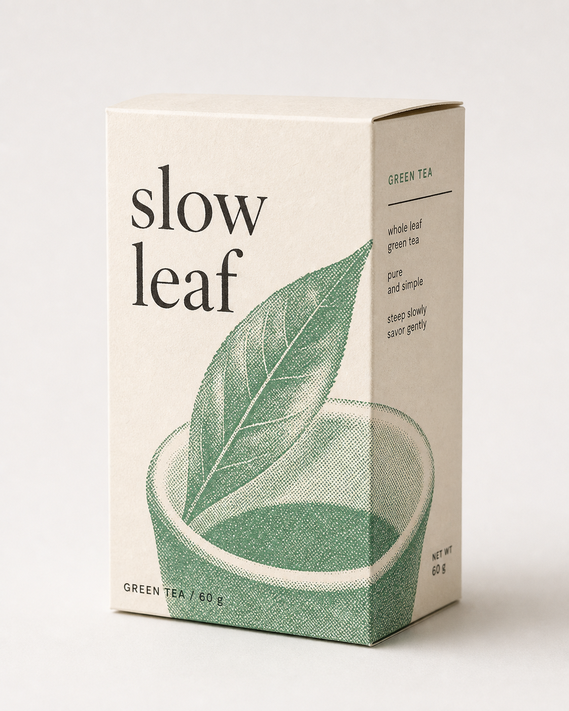

# `art-mono-color`（单色/双色孔版印刷海报）

- **所属大类**：🎨 视觉创意（Creative）
- **技能配置**：[`skills/creative/art-mono-color`](../skills/creative/art-mono-color/SKILL.md)
- **原始出处**：Adapted from [yanliudesign/mono-color-skill](https://github.com/yanliudesign/mono-color-skill) by [@yanliudesign](https://github.com/yanliudesign) (MIT License)

---

## 📌 是干什么的

把任意主题、句子、物件或照片，转为**单色/双色孔版印刷（Risograph）、网点照片、大面积留白与高质感当代编辑排版海报（Duotone / Zine Poster）**。

### 核心设计哲学
- **严格油墨限制**：只使用 1 种或受控的 2 种印刷油墨（如钴蓝、赤陶橙、植物绿、深黑），绝不出现数码渐变或无节制的杂色；
- **真实中性纸底**：以米白、中性白或冷灰等无酸纸为底，保留 25%-55% 的大面积呼吸留白；
- **机械网点质感**：照片转化为清晰可见的半色调网点（Halftone）或孔版质感，还原实体杂志/Zine 的物理印刷美感；
- **当代版面张力**：大字号标题与克制的功能性小字产生 5x-12x 的尺度跃迁，形成强烈的平面设计张力。

---

## 💬 怎么用

向支持视觉生图的 Agent 发送任意提示词或照片：

### 常用触发词示例
- 💬 *“使用 `art-mono-color`，做一张关于城市夏夜骑行的海报”*
- 💬 *“用 `art-mono-color` 把这张茶具照片做成绿色网点编辑封面”*
- 💬 *“使用双色印刷风格设计一张咖啡豆标本的 Zine 海报，蓝橙双色叠印”*

---

## 🖼️ 效果展示

### 案例 1：双色叠印 · 城市骑行 (Cobalt + Terracotta)

| 蓝橙双色孔版海报 (Duotone Print) |
| :---: |
|  |

> **配方解析**：
> - **配色**：钴蓝 (`#2148B8`) + 赤陶橙 (`#C65F38`)，中性白纸底；
> - **排版**：大号无衬线文字与网点照片产生物理穿插与叠印效果，具备强烈的现代杂志封面质感。

---

### 案例 2：单色网点 · 茶道器物 (Botanical Green)

| 单色植物绿编辑海报 (One-Ink Print) |
| :---: |
|  |

> **配方解析**：
> - **配色**：单色植物绿 (`#008A4B`)，冷白纸张肌理；
> - **网点处理**：物体采用机械半色调分离，留出大面积安静负空间，文雅克制。
