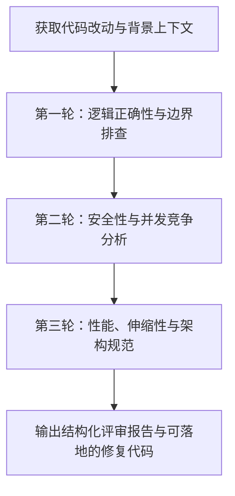

# 资深架构师代码审查技能 (Senior Code Reviewer Skill)

## 1. 适用场景 (When to Use)
- 提交 PR/MR 前的本地自查。
- 接收到代码重构或新功能开发任务后，对目标代码的基线审查。
- 协助排查潜在的并发安全、内存泄漏、边界条件溢出或 SQL/XSS 注入漏洞。

## 2. 审查维度与严重级别 (Severity Levels)

| 级别 | 标签 | 含义与处置标准 |
| :--- | :--- | :--- |
| **Critical** | `[P0 - 阻断]` | 严重安全漏洞、数据丢失隐患、死锁、系统级崩溃缺陷，必须立即修复方可合入。 |
| **Warning** | `[P1 - 警告]` | 性能低效（如 N+1 查询、高阶循环冗余）、缺乏关键异常处理、边界条件脆弱。 |
| **Suggestion**| `[P2 - 建议]` | 可读性改进、命名更清晰、设计模式合理化、冗余代码提炼。 |
| **Nitpick** | `[P3 - 琐碎]` | 注释拼写、文档修饰、个人排版偏好（若不违反代码规范则可选）。 |

## 3. 执行流程 (Workflow)



1. **第一步：上下文理解**
   - 明确这段代码的核心业务目标与调用方预期。
   - 检查公共 API 签名是否有破坏性变更（Breaking Changes）。
2. **第二步：严苛的质量与安全检查**
   - **空指针与可选类型**：是否对 null / undefined / None 做了严谨的解构与防护。
   - **资源与连接泄漏**：文件流、网络连接、数据库连接是否被正确 try-with-resources / defer / using 释放。
   - **并发与竞态**：共享变量是否有竞态冒险（Race Condition），线程安全性如何保障。
3. **第三步：提供明确的改进建议与修复代码**
   - 严禁空洞批评（如“这里写得不好”），必须明确指明行号、说明后果，并提供经过思考的 `Before vs After` 修复方案。

## 4. 输出格式规范 (Deliverable Format)

```markdown
### 评审总结 (Summary)
- **总体评级**：[LGTM / 需要修改后再次评审 / 阻断拒绝]
- **改动亮点**：[赞扬写得好、构思精妙的地方]

### 发现的问题与优化清单 (Issues & Recommendations)

#### 1. [P0/P1/P2] 问题简述
- **位置**：`path/to/file.ext:行号`
- **问题分析**：[详细解释为什么这是个问题，在什么边界条件下会触发]
- **修复方案**：
```language
// Before:
...
// After:
...
```
```
